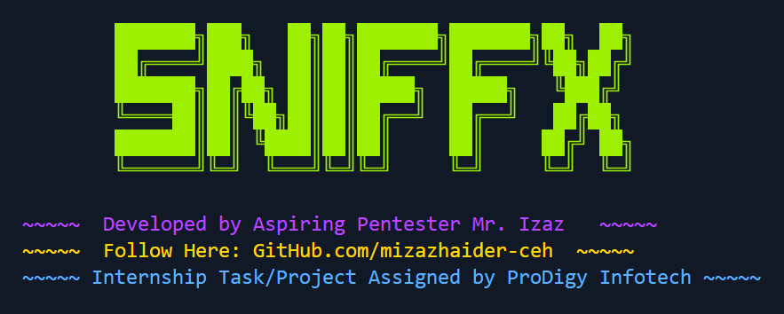
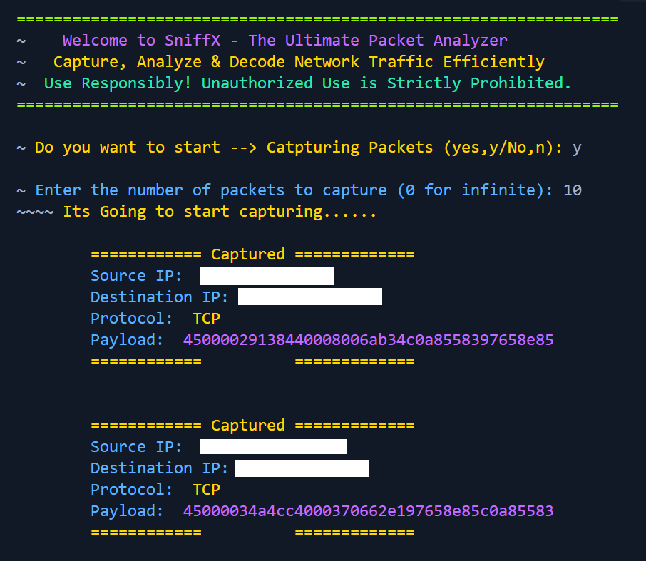
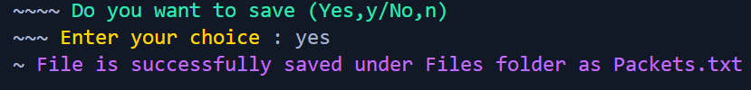
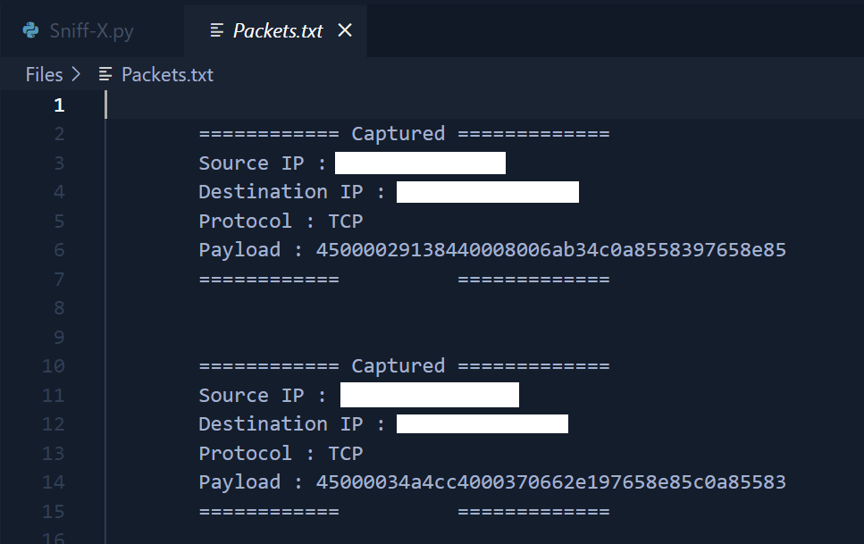

# Sniff-X - Ethical Packet Sniffer


## **Developed by:** Muhammad Izaz Haider

**Internship Project at:** Prodigy InfoTech

## 📌 **Overview**

**Sniff-X** is an ethical network packet sniffer designed for security research and testing. It captures network packets in real time, allowing users to analyze data transmission ethically and responsibly. This tool is intended for educational and penetration testing purposes only, with explicit user consent.

## 🛠 **How Sniff-X Works**

Sniff-X listens to network traffic and logs the captured packets. It includes the following features:

✔️ Captures and logs network packets in real-time

✔️ Supports multiple network interfaces

✔️ Filters packets based on protocols (TCP, UDP, ICMP, ARP, etc.)

✔️ Displays packet details (source, destination, protocol, etc.)

✔️ Requires **explicit user permission** before running

✔️ Outputs **color-coded** live logs for better readability

✔️ Cross-platform support (Windows, Linux, macOS)

## 📌 **Features**

✅ Ethical and transparent packet sniffing (requires user consent)

✅ Captures TCP, UDP, and ICMP traffic

✅ Filters packets based on protocol types

✅ Lightweight and efficient Python script

✅ **Colorful live output for better readability**

✅ Compatible with Windows, Linux, and macOS

✅ Safe for ethical hacking and cybersecurity research

## 📂 **Project Structure**

```
PRODIGY_CS_04-Sniff-X/
│── Sniff-X.py          # Main Python script
│── README.md           # Project documentation
│── screenshots/        # Folder containing example outputs
│   │── logo.png        # Project logo
│   │── savings.png     # Packet capture example
│   │── working.png     # Sniff-X running in action
│   │── file.png        # Saved packet logs
```

## 🖥 **Screenshots**

### **🔹 Project Logo:**


### **🔹 Sniff-X Running:**



### **🔹 Captured Packets:**



### **🔹 Saved Packet Log File:**



## 🎯 **Why I Built This Project**

This project was developed as part of my internship at **Prodigy InfoTech** to explore packet sniffing techniques in a controlled, ethical, and educational manner. It reinforced my understanding of network traffic analysis and security best practices.

## 📚 **What I Learned**

✔️ Ethical considerations in network traffic monitoring

✔️ Python socket programming and packet interception

✔️ Deepened my understanding of network security and monitoring tools

✔️ Real-time packet analysis techniques

✔️ Handling network interfaces for data capture

✔️ Writing efficient logging mechanisms for security tools

✔️ Implementing user-friendly terminal outputs with colors

## 🛠 **Installation & Usage**

### **🔹 Prerequisites**

Ensure you have **Python 3.x** installed.

### **🔹 Clone the Repository**

```bash
git clone https://github.com/mizazhaider-ceh/PRODIGY_CS_04-Sniff-X.git
cd PRODIGY_CS_04-Sniff-X
```

### **🔹 Install Dependencies**

Install the required Python package:

```bash
pip install scapy
```

### **🔹 Run the Program**

✅ **On Windows:**

```bash
python Sniff-X.py
```

✅ **On Linux/macOS:**

```bash
chmod +x Sniff-X.py
sudo python3 Sniff-X.py
```

🔹 **Note:** Running Sniff-X requires administrator privileges to capture network traffic.

## 🔹 **Usage Instructions**

1️⃣ The program will display a **banner** and ask for  **user consent** .

2️⃣ If the user agrees (`Y`), packet sniffing will start.

3️⃣ Captured packets will be displayed in real-time  **with color-coded output** .

4️⃣ The data will also be saved in a log file for analysis.

5️⃣ Press `CTRL+C` to stop sniffing.

## 🌟 **Special Thanks**

A huge thanks to **Prodigy InfoTech** for providing this internship opportunity, allowing me to apply ethical hacking and Python skills in real-world projects.

## 🏆 **The Project Ends... But The Journey Begins!**

If you like this project, consider giving it a ⭐ on  **GitHub** !

🔗 [GitHub Repository](https://github.com/mizazhaider-ceh/PRODIGY_CS_04-Sniff-X)

## 📜 **License**

This project is open-source and available under the  **MIT [LICENSE](LICENSE)** .

## 📬 **Connect with Me**

* **GitHub:** [mizazhaider-ceh](https://github.com/mizazhaider-ceh)
* **LinkedIn:** [Muhammad Izaz Haider](https://www.linkedin.com/in/muhammad-izaz-haider-091639314/)
* **Email:** [mizazhaider@gmail.com](mailto:mizazhaider@gmail.com)
